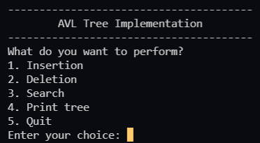

Program: To implement the AVL Tree
Note: makeFile "avl_tree" will work only on linux

Steps to run the program-  
    1. Open a terminal.  
    2. Compile the avl_tree.cpp file using gcc or mingw compiler. If you are using mingw compiler run "g++ avl_tree.cpp"  
    3. An a.exe executable file will be generated.  
    4. Run this a.exe file. A menu will be generated showing all the possible operations. 
     
    5. Enter the number corresponding to the operations you want to perform. 
    6. If you want to perform "Print tree" operation, the program will ask for a filename, 
       then the image of the tree will be generated with the same filename. 
